# 💊 Pharmacy Management System

A comprehensive desktop-based Pharmacy Management System developed using **C#**, **WinForms**, **ADO.NET**, and **SQL Server** following a **3-Tier Architecture**.

The system simulates a real-world pharmacy environment by managing customers, products, inventory, sales, shopping carts, user permissions, and financial transactions while ensuring data consistency using SQL Server Transactions and Stored Procedures.

---

# 📌 Features

## Authentication & Authorization
- Secure Login System
- Role-Based Access Control (RBAC)
- User Registration
- Administrator Approval Workflow
- Permission Management

---

## Customer Management

- Register new customers
- Update customer information
- Customer account activation
- Customer balance management
- Customer purchase history

---

## Product Management

- Add, Edit and Delete products
- Product Categories
- Inventory Management
- Quantity Tracking
- Stock Monitoring

---

## Shopping Cart

- Add products to cart
- Remove products
- Update quantities
- Calculate invoice total automatically

---

## Checkout System

A complete checkout workflow has been implemented using **SQL Server Transactions** to guarantee data consistency.

During checkout, the system performs:

- Validate cart contents
- Validate stock availability
- Validate customer balance
- Create a sale record
- Create Sale Details
- Update inventory quantities
- Deduct customer balance
- Empty shopping cart
- Commit transaction

If any step fails, the entire transaction is rolled back automatically.

---

## Sales Management

- Sales records
- Sale Details
- Invoice generation
- Sales history
- Customer purchase tracking

---

## Database Features

- SQL Server Database
- Fully normalised relational database
- Stored Procedures
- Transactions
- Foreign Keys
- Constraints
- Aggregate Queries
- Joins

---

# 🏗 Architecture

The application follows a classic **3-Tier Architecture**.

Presentation Layer

↓

Business Layer

↓

Data Access Layer

↓

SQL Server Database

This separation improves maintainability, scalability, and code organization.

---

# 🛠 Technologies

- C#
- .NET Framework
- WinForms
- SQL Server
- ADO.NET
- T-SQL
- Stored Procedures
- SQL Transactions
- OOP
- Git
- GitHub

---

# 📂 Project Structure

```
Presentation Layer
│
├── Forms
├── User Controls
├── Utilities

Business Layer
│
├── Customers
├── Products
├── Sales
├── Users
├── Permissions

Data Access Layer
│
├── SQL Queries
├── Stored Procedure Calls
├── Database Connection

Database
│
├── Tables
├── Stored Procedures
├── Relationships
```

---

# 🔄 Checkout Transaction

The checkout process is fully transactional.

```
Validate Cart
      │
      ▼
Validate Stock
      │
      ▼
Validate Customer Balance
      │
      ▼
Create Sale
      │
      ▼
Create Sale Details
      │
      ▼
Update Inventory
      │
      ▼
Update Customer Balance
      │
      ▼
Clear Shopping Cart
      │
      ▼
Commit Transaction
```

If any operation fails, SQL Server automatically performs a rollback.

---

# 📸 Screenshots

## Login

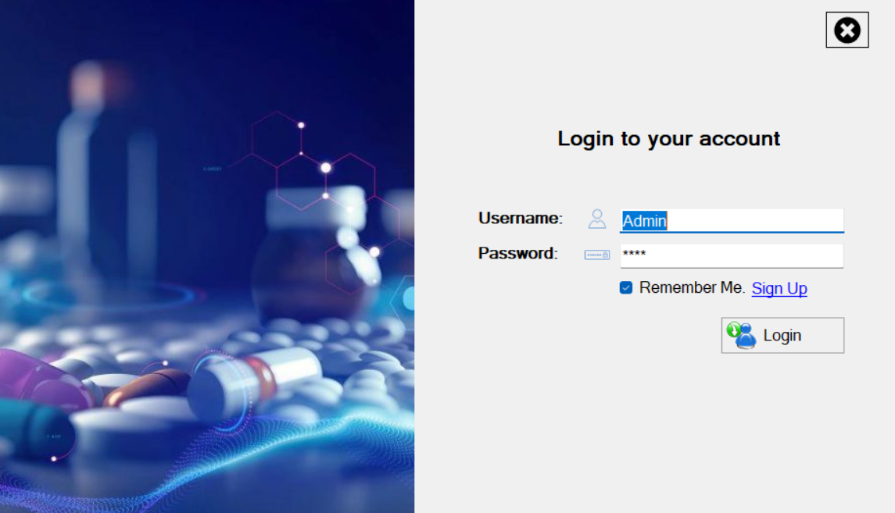
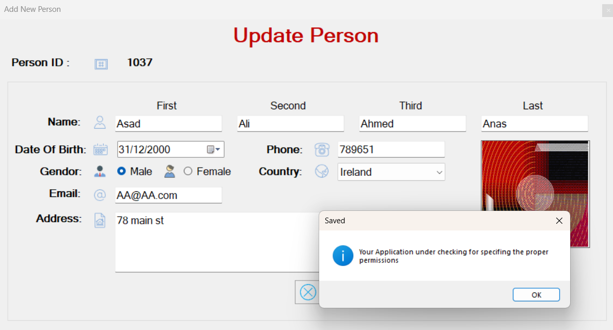

---

## Dashboard


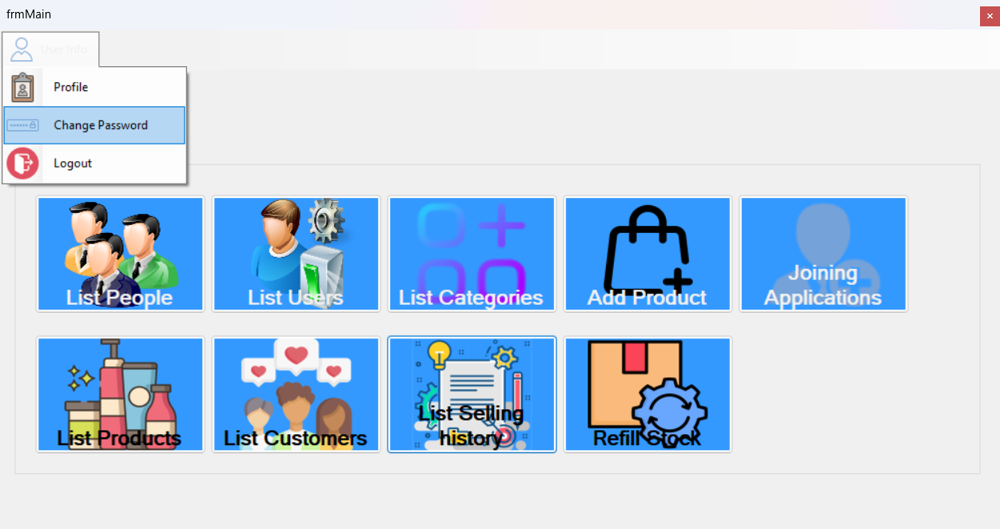

---

## Products


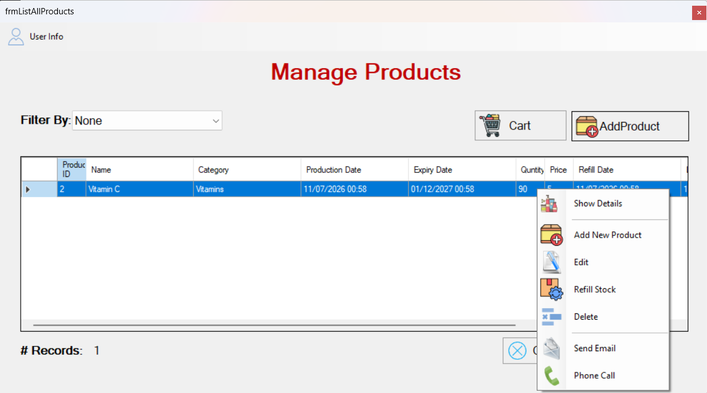
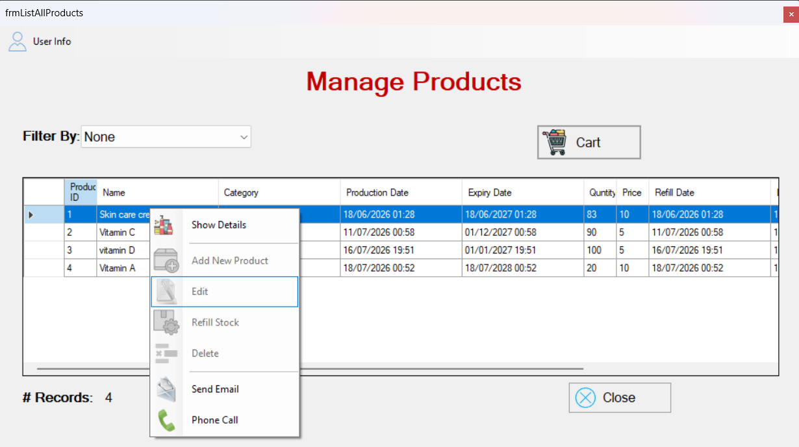
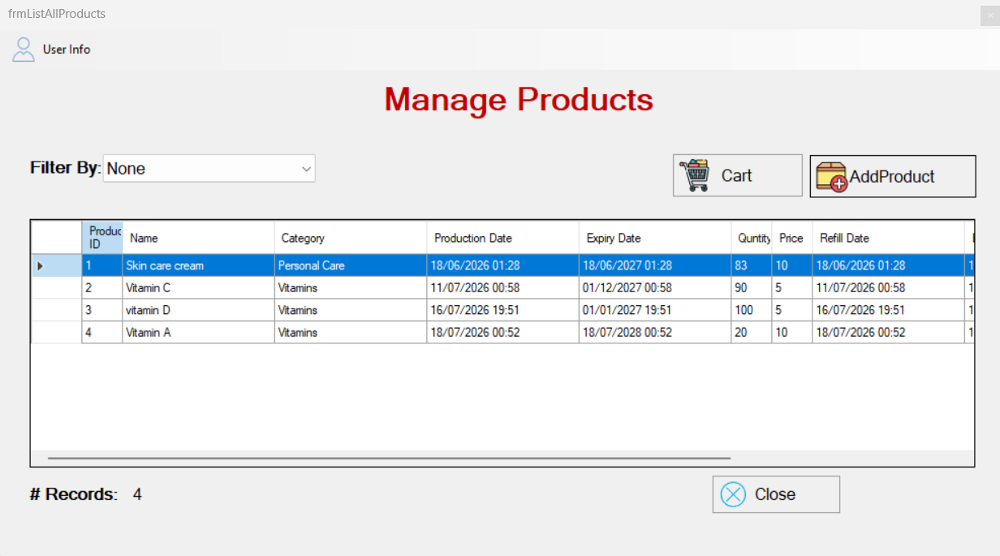
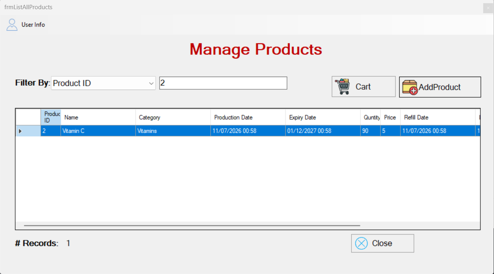
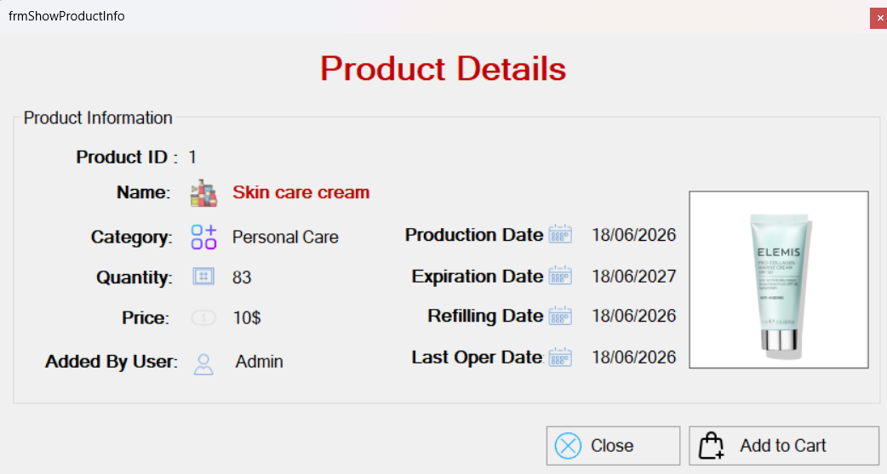

---

## Customers

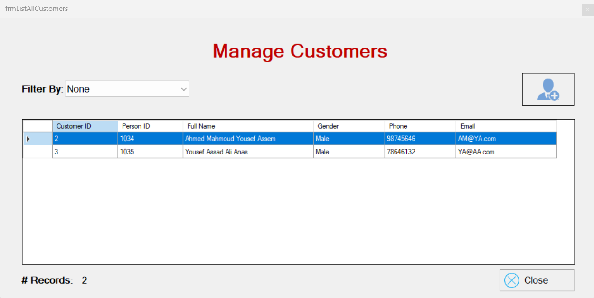
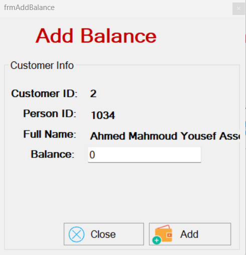

---

## Shopping Cart

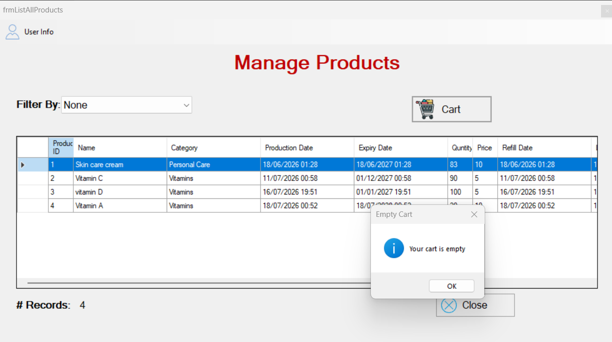
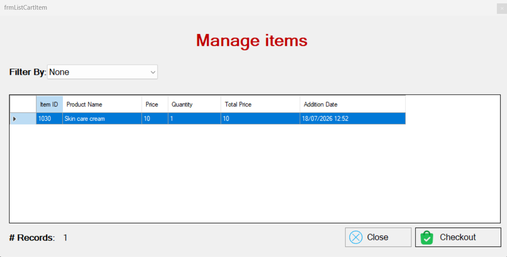

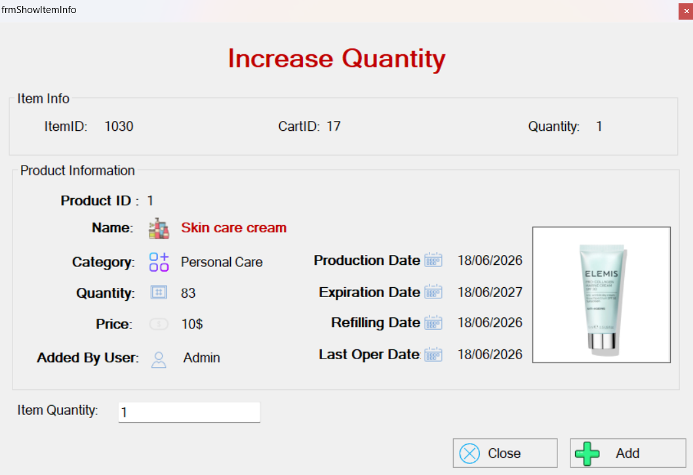

---

## Checkout

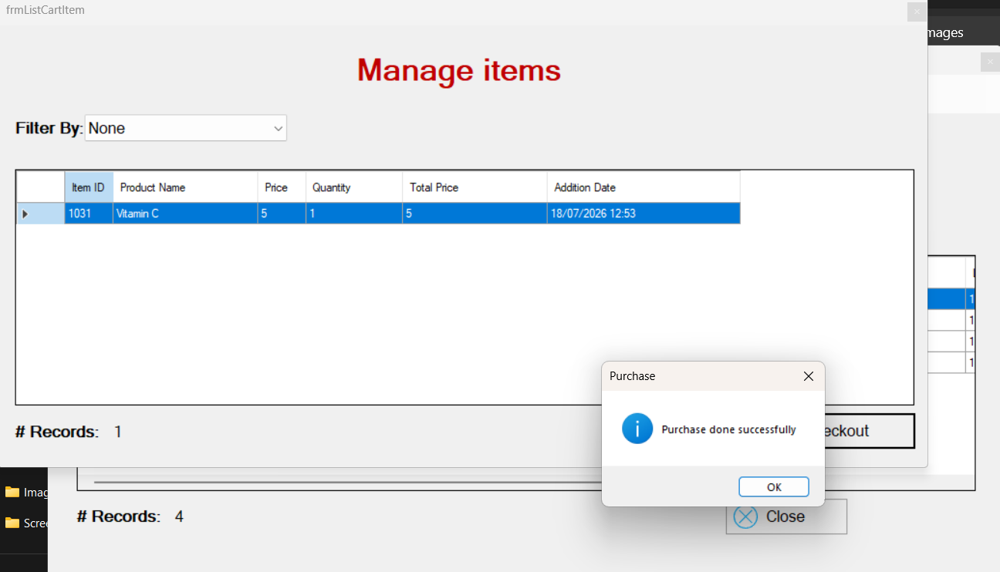


---

## Sales

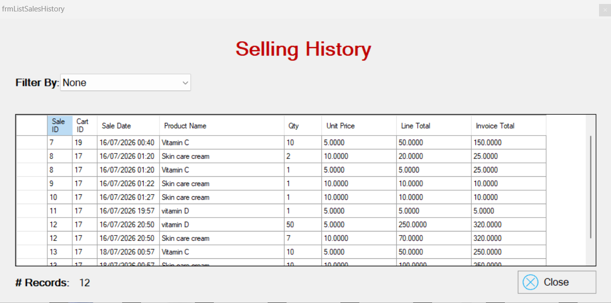

---

# 🗂 Database Diagram

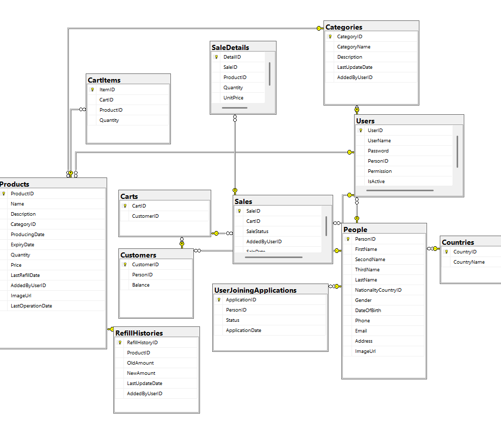

---

# 🚀 Future Improvements

- Email Notifications
- Barcode Scanner Integration
- Receipt Printing
- Reporting Dashboard
- Entity Framework Migration
- ASP.NET Core Web API
- Cloud Database Support

---

# 📚 What I Learned

Through this project, I strengthened my understanding of:

- Object-Oriented Programming
- Database Design
- SQL Server
- Stored Procedures
- SQL Transactions
- 3-Tier Architecture
- ADO.NET
- Business Logic Design
- Role-Based Authorisation
- Inventory Management

---

# 👨‍💻 Author

**Mahmoud Abed**

Junior .NET Developer

LinkedIn:
https://www.linkedin.com/in/mahmoud-abed-7962b616a/

GitHub:
https://github.com/MahmoudAbed7

Email:
mahmoud.abed.2.7.2000@gmail.com

---

⭐ If you found this project interesting, feel free to star the repository.
